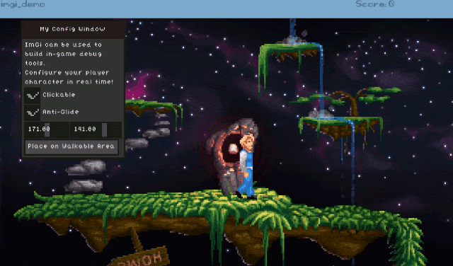

# ImGi
AGS Script Module for Immediate Gui, uses script Overlays to render the interface.



## usage

```AGS Script
function repeatedly_execute() // In Room Script, use room_RepExec() 
{
  ImGi.Begin(); 
    
  if(ImGi.BeginWindow("Hello World", 32, 32, 130, 60, eImGi_Opt_AlignCenter | eImGi_Opt_NoClose))
  {
    int row[];
                   
    row = new int[2];
    row[0] = 60; // set a predefined column width size per element in row
    row[1] = 70; // this is the width of other column
    ImGi.LayoutRow(2 /*n columns*/, row); // rows after this line have such column config
        
    ImGi.Label("A Label:");
    if(ImGi.Button("A Button!"))
    {
      player.Say("You clicked the button!");
    }    
  
    ImGi.EndWindow();
  }
    
  ImGi.End();  
}
```

## script API

ImGi entire API uses static functions and attributes

### Basic

#### ` ImGi.Begin`
```
void ImGi.Begin()
```

Call only once per frame and make sure to call End() after.

#### `ImGi.End`
```
void ImGi.End()
```

Call only once per frame, after Begin() is called.


---

### Layout System

#### `ImGi.LayoutRow`
```
void ImGi.LayoutRow(int count, int widths[], int height = 0)
```

Pass an array of widths with count elements to configure the columns in a row. You can optionally specify a height.


---

### Window

A window can be created by a `BeginWindow` and if this is successful (returns any non false value),
it has to call EndWindow to specify where it logically ends.
All controls must exist within a window.

#### `ImGi.BeginWindow`
```
ImGi_Res ImGi.BeginWindow(String title, int x, int y, int width, int height, ImGi_Opt opt = 0)
```

Creates a window, make sure to call a matching EndWindow() if this method return is not false.

#### `ImGi.EndWindow`
```
void ImGi.EndWindow()
```

Has to be called each time a BeginWindow is successful once all elements inside the window are listed

#### `ImGi.OpenWindow`
```
void ImGi.OpenWindow(String title)
```

If a window of matching title is closed, it opens again.

---

### Controls

Controls are things you can place inside a window. Controls cannot exist outside of windows.

#### `ImGi.Label`
```
void ImGi.Label(String label)
```


This control is a Label containing the specified text.

#### `ImGi.Text`
```
void ImGi.Text(String text)
```


This control is a Multiline Label for visualization only.

#### `ImGi.TextBox`
```
String ImGi.TextBox(String label, String buf, int bufsz, ImGi_Result* res = 0, ImGi_Opt opt = 0)
```

This control is an editable TextBox.

#### `ImGi.Button`
```
ImGi_Res ImGi.Button(String label, ImGi_Icon icon = 0, ImGi_Opt opt = eImGi_Opt_AlignCenter)
```


his control is a Button.

#### `ImGi.CheckBox`
```
mGi_Res ImGi.CheckBox(String label, CheckBoxState* chkst)
```


This control is a CheckBox.

#### `ImGi.Number`
```
ImGi_Res ImGi.Number(String label, ImGi_Real* value, float step = 0, ImGi_Opt opt = 0)
```


This control shows a Number, set step to allow quick mouse drag adjustments

#### `ImGi.Slider`
```
ImGi_Res ImGi.Slider(String label, ImGi_Real* value, float low, float high, float step = 0, ImGi_Opt opt = 0)
```


This control is a Slider.


---

### Style and Design customisation

#### `ImGi.Style`
```
ImGi_Style* ImGi.Style
```

Holds the Current Style for ImGi.


---

## License

This code is licensed with MIT [`LICENSE`](LICENSE). The code on this module is based on rxi's Microui, which is also MIT licensed and is referenced in the license, this port though has many changes - and new bugs.
